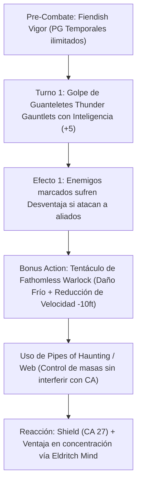

# Resumen General del Personaje: Armorlock

## Datos Generales

* **System Standard:** D&D 5th Edition (2014 Ruleset / 2024 Compatible)
* **Character Level:** 20 (Artificer [Armorer] 17 / Warlock [Fathomless] 3)
* **Species:** Githzerai (*Githzerai Mental Discipline*, *Githzerai Psionics* -> *Shield* gratis)
* **Background:** Sage / Guild Artisan (Dote: *Fey Touched* / *Telekinetic*)
* **Stats (Point Buy + Racial + ASIs):**
  * **STR:** 8 (-1) *(¡DUMPED! Ignorado por el Modelo de Armadura Guardian)*
  * **DEX:** 8 (-1) *(¡DUMPED! Ignorado gracias a la Armadura Pesada)*
  * **CON:** 16 (+3) *(15 Base + 1 ASI — Puntos de Golpe y Concentración)*
  * **INT:** 20 (+5) *(15 Base + 2 Racial + 1 Fey Touched + 2 ASI)*
  * **WIS:** 10 (+0)
  * **CHA:** 14 (+2) *(Requisito de Multiclaseo de Brujo)*

Bastión y Tiempo Muerto: ./bastion and downtime.md

### Actual Item List

Actual Item List: ./actual inventory list.md

1. **Powered Arcane Heavy Armor (+3):** Modelo Guardian que permite equipar armaduras pesadas sin requerir Fuerza y atacar con Inteligencia.
2. **Repulsion Shield (+2):** Escudo infusionado para empujar a enemigos que intenten acercarse a aliados frágiles.
3. **Pipes of Haunting:** Instrumento utilitario que infunde Miedo en un área de 30 pies sin requerir concentración.

---

## Combat Role: Frontline Heavy Tank, Aggro Taunter & Speed Controller

### 1. Gestión de Recursos y Reglas de Inventario

* **Dump de Fuerza y Destreza Sin Penalizaciones:** Gracias al rasgo **Armor Model (Guardian)** del Artífice Armero, puedes vestir cualquier Armadura Pesada (ej. Placas) ignorando completamente las restricciones de Fuerza mínima. Los ataques desarmados de tus guanteletes (*Thunder Gauntlets*) usan tu modificador de **Inteligencia (+5)**.
* **Aggro y Desventaja Enemiga (Thunder Gauntlets):** Cualquier enemigo impactado por tus guanteletes sufre **Desventaja en todas sus tiradas de ataque contra cualquier criatura que NO seas tú** hasta el comienzo de tu siguiente turno.
* **Invocaciones de Brujo (Fiendish Vigor & Eldritch Mind):** *Fiendish Vigor* permite iniciar cada combate con Puntos de Golpe Temporales renovables a voluntad. *Eldritch Mind* otorga **Ventaja constante en todas las tiradas de salvación de Constitución para mantener la concentración**.

### 2. Action Economy & Combat Loop

* **Pre-combat:** Lanza *Fiendish Vigor* para cargar PG Temporales. Activa *Githzerai Mental Discipline* (Ventaja en salvaciones contra *Charmed* y *Frightened*).
* **Turno 1:**
  * **Action:** Lanza **Web** (control de área masivo) o ataca con tus *Thunder Gauntlets* (marca a 2 enemigos imponiéndoles Desventaja si atacan a tus aliados).
  * **Bonus Action:** Invoca el **Tentáculo de las Profundidades (Fathomless Tentacle)** a 60 ft para atacar e infligir daño de frío + reducir la velocidad del enemigo en 10 ft.
* **Turno 2+:**
  * **Action:** Doble ataque de guanteletes (marca a 2 enemigos con *Thunder Gauntlets*) o usa *Pipes of Haunting* (área de Miedo sin concentración).
  * **Bonus Action:** Re-activa el Tentáculo o recupera PG Temporales con *Defensive Field*.
  * **Reaction:** *Shield* (CA 25-27+), *Absorb Elements* o empujón con *Repulsion Shield*.

---

## 3. The META Combo: Double-Taunt & Speed Reduction Lock

🧮 Mathematical Engine (D&D 5e):

$$\text{CA Definitiva} = 18_{\text{Placas}} + 2_{\text{Escudo}} + 2_{\text{Infusión}} + 5_{\text{Shield}} = 27\text{ CA}$$

$$\text{Salvación Concentración} = P(\text{Éxito con Ventaja}) \text{ con } +8_{\text{CON}} \text{ (Proficiente)}$$

---

## 4. Tabla de Rendimiento Táctico

| Criterio | Valoración | Justificación Mecánica |
| :--- | :---: | :--- |
| **Daño Monobjetivo** | 🟢 | Daño constante de guanteletes electrificados + ataque adicional por Bonus Action con el tentáculo arcano. |
| **Control de Masas (CC)** | 🔵 | Control mediante *Web*, *Pipes of Haunting* (miedo sin concentración), lentitud de tentáculo y marcas de aggro. |
| **Supervivencia (EHP)** | 🔵 | CA 27+, ventaja en salvaciones de salud mental (*Githzerai Discipline*), PG temporales infinitos y concentración indestructible. |
| **Economía de Acciones** | 🔵 | Uso optimizado de Acción (Ataques/Pipes), Acción Adicional (Tentáculo) y Reacción (*Shield*/*Repulsion Shield*). |
| **Sustentabilidad** | 🔵 | No depende de Fuerza ni Destreza. Recarga PG Temporales a voluntad entre combates (*Fiendish Vigor*). |

---

## 5. Home Rules (Reglas de la Mesa)

1. **Foco Universal Único:** La armadura mística actúa como foco arcano único para hechizos de Artífice y Brujo.
2. **Progresión Full Caster Integrada:** Espacios de conjuro unificados para slots de Artífice y Pact Magic de Brujo.
