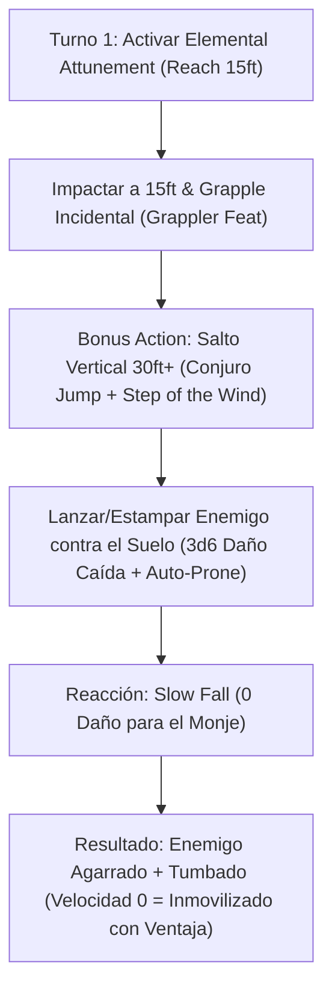

# Resumen General del Personaje: Hurricane Monk (Crag Horn Climber)

## Datos Generales

* **System Standard:** D&D 5th Edition (2024 / 5.5e Update)
* **Character Level:** 20 (Monk [Warrior of Elements] 19 / Ranger 1)
* **Species:** Goliath (Hill Goliath — *Hill Giant's Tumble*, *Large Form*)
* **Background:** Guide (Origin Feat: *Magic Initiate [Druid/Ranger]* -> Conjuro: *Jump*)
* **Stats (Point Buy + Background + ASIs):**
  * **STR:** 12 (+1) *(Standard Array)*
  * **DEX:** 20 (+5) *(15 Base + 2 Background + 1 Dote Grappler + 2 ASI Nivel 9)*
  * **CON:** 14 (+2) *(13 Base + 1 ASI)*
  * **INT:** 8 (-1) *(Standard Array)*
  * **WIS:** 18 (+4) *(14 Base + 2 ASI Nivel 13 + 2 ASI Nivel 17)*
  * **CHA:** 10 (+0) *(Standard Array)*

Bastión y Tiempo Muerto: ./bastion and downtime.md

### Actual Item List

Actual Item List: ./actual inventory list.md

1. **The Four-Fold Burden (El Gravamen de Cuatro Dobles):** Objeto narrativo/entrenamiento mágico concedido por la mentora Ashari. Actúa como lastre físico y elemental que muta a cada nivel (estilo pesas de Rock Lee) hasta ser retirado a nivel 20 (*Boon of Speed*).
2. **Wraps of Daelkyr / Unarmed Strike Wraps (+3):** Vendor/Loot de nivel alto para ignorar resistencias y añadir +3 a impacto y daño desarmado.
3. **Bracers of Defense:** +2 a la CA mientras no viste armadura ni empuñas escudo (CA Total = 10 + 5 DEX + 4 WIS + 2 Bracers = 21 CA).
4. **Ring of Free Movement / Cloak of Displacement:** Garantiza movilidad fluida o desventaja en ataques recibidos.

---

## Combat Role: Martial Controller, Aerial Pile-Driver & Battlefield Dominator

### 1. Gestión de Recursos y Reglas de Inventario

* **Economía de Manos y Grapple a Distancia (15 ft Reach):** Bajo la regla confirmada por Wizards of the Coast (Mike Mearls), el alcance de 15 pies concedido por *Elemental Attunement* se aplica a los ataques desarmados usados para agarrar (*Grapple*). Esto permite inmovilizar enemigos a 15 pies de distancia sin quedar a su alcance cuerpo a cuerpo.
* **Grapple Incidental:** Con la dote **Grappler** (2024), al impactar con un ataque desarmado puedes infligir daño y agarrar al objetivo automáticamente dentro de la misma acción de ataque, eliminando la necesidad de sacrificar ataques para inmovilizar.
* **Jump Economy:** El dip de 1 nivel en Ranger (Nivel 6) otorga 2 espacios de conjuro de 1.er nivel para lanzar *Jump* repetidamente sin depender únicamente de la dote *Magic Initiate*, permitiendo triplicar la distancia de salto vertical en cada combate.

### 2. Action Economy & Combat Loop

* **Pre-combat / Turno 1 Setup:**
  * **Bonus Action:** Activa *Elemental Attunement* (1 Focus point — otorga 10 ft extra de alcance desarmado, tipo de daño elemental a elección y empuje/atracción de 10 ft por impacto) o *Large Form* (Goliath).
  * **Action:** Ataques desarmados a 15 ft de alcance. Agarra automáticamente al objetivo principal gracias a *Grappler*.
* **Turno 2+ (El Combo de Martinete Aéreo / Pile-Drive):**
  * **Movement / Bonus Action:** Lanza *Jump* o activa *Step of the Wind*. Salta 30+ pies verticalmente cargando al enemigo agarrado (las criaturas agarradas no reducen tu velocidad si eres *Large Form* o posees alta capacidad).
  * **Free Action:** Suelta al enemigo en el punto más alto del salto o entra en caída libre conjunta.
  * **Efecto en el Enemigo:** Sufre $3\text{d}6$ de daño por caída y queda **automáticamente en estado Tumbado (Prone)**. Al estar Agarrado (Velocidad = 0), **no puede levantarse**, otorgando Ventaja a todos los ataques cuerpo a cuerpo aliados y Desventaja a sus ataques.
  * **Reaction:** Activa **Slow Fall** (Caída Lenta) para reducir tu propio daño de caída a 0.

---

## 3. The META Combo: Hurricane Martial Control & Cheese Grater Engine

🧮 Mathematical Engine (D&D 5e (2024 / 5.5e)):

$$\text{DPR Base (Nivel 20)} = 4 \times \left[ P(\text{Hit}) \times (1\text{d}12 + 5_{\text{DEX}} + 3_{\text{Item}}) + P(\text{Crit}) \times (1\text{d}12) \right] + 3\text{d}6_{\text{Caída}}$$

$$\text{Desplazamiento Forzado por Turno} = 15\text{ ft (Reach)} + 10\text{ ft (Empuje/Atracción)} + 30\text{ ft (Salto Aéreo)} = 55\text{ ft/turno}$$

* **Combo Cheese Grater (Rallador de Queso):** Si un aliado lanza *Spike Growth*, *Cloud of Daggers* o *Wall of Fire*, el Monje puede arrastrar al enemigo 15 ft hacia adentro con su alcance, golpearlo para empujarlo 10 ft más a través del área, y arrastrarlo con su movimiento completo sin sufrir daño personal (gracias a los 15 ft de distancia de agarre).

---

## 4. Tabla de Rendimiento Táctico

| Criterio | Valoración | Justificación Mecánica |
| :--- | :---: | :--- |
| **Daño Monobjetivo** | 🟢 | 4 a 5 ataques de d12+5 con Ventaja constante por Grapple+Prone, más daño extra por caída ($3\text{d}6$). |
| **Control de Masas (CC)** | 🔵 | Impresionante control sin salvación: empuje de 40ft/turno, atracción de 15ft, inmovilización aérea y *Knock Prone* nativo por *Hill Goliath*. |
| **Supervivencia (EHP)** | 🔵 | CA 21+, *Deflect Attacks/Energy*, *Evasion*, proficiencia en todas las salvaciones (*Discipline of Survivor*), resistencia a todo daño salvo fuerza (*Superior Defense*). |
| **Economía de Acciones** | 🔵 | Agarre integrado en el ataque desarmado sin perder acción, salto aéreo en Acción Adicional y *Slow Fall* en Reacción. |
| **Sustentabilidad** | 🟢 | Recuperación total de Focus en descansos cortos, *Uncanny Metabolism*, e inicio garantizado con al menos 4 Focus en cada combate (*Perfect Focus*). |

---

## 5. Home Rules (Reglas de la Mesa)

1. **Foco Universal Único:** No requiere componentes somáticos o materiales sencillos para los conjuros de Ranger/Druida mientras porte sus vendas o foco monástico.
2. **Progresión Full Caster Integrada:** Si multiclasea con clases de lanzadores en el futuro, suma niveles completos para la tabla de espacios de conjuro.
3. **Ruling de Agarre a Distancia (WotC Oficial):** El alcance de 15 ft de *Elemental Attunement* modifica las propiedades del *Unarmed Strike*, permitiendo iniciar y mantener un *Grapple* a 15 pies del personaje.

