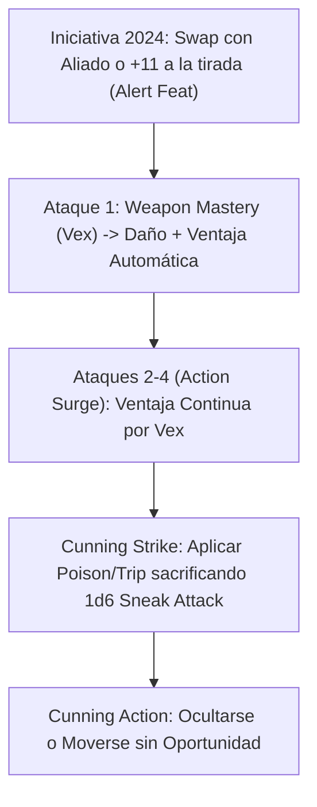

# Guía 2024: Super Sneaker Life Deleter (D&D 5.5e)

## Cambios Clave 2024 para el Asesino Táctico

Bajo las reglas de **D&D 5e (2024 / 5.5e Update)**, esta build obtiene mejoras significativas en la economía de acciones y armas:

1. **Weapon Mastery (Dominio de Armas):**
   - **Vex (Hand Crossbow / Shortbow):** Al impactar a un enemigo, obtienes **Ventaja en tu siguiente ataque** contra él antes del final de tu siguiente turno, creando una cadena ininterrumpida de ataques con ventaja sin depender de ocultarte.
   - **Nick (Dagger):** Permite realizar el ataque adicional de dos armas como parte de la **Acción de Ataque** en lugar de consumir la Acción Adicional.

2. **Cunning Strike (Rogue Nivel 5+):**
   - Permite sacrificar dados de *Sneak Attack* ($1\text{d}6$) para aplicar efectos secundarios como **Poison** (Envenenar), **Trip** (Derribar) o **Withdraw** (Retirarse sin provocar ataques de oportunidad).

3. **Revisión de Dotes de Origen:**
   - **Alert Feat (2024):** Otorga un bonificador a la Iniciativa igual a tu Bonificador de Competencia (+6 a nivel alto) y permite **intercambiar la iniciativa** con un aliado voluntario al inicio del combate.

---

## Progresión Táctica y Combate en 2024

## Tabla de Armas y Masteries

| Arma | Propiedad Mastery | Uso Táctico en el Build |
| :--- | :---: | :--- |
| **Hand Crossbow** | **Vex** | Garantiza ventaja continua en la cadena de 4 ataques de *Action Surge*. |
| **Heavy Crossbow / Longbow** | **Push / Slow** | Ralentiza o empuja 10 ft a los enemigos para mantener la distancia. |
| **Dagger** | **Nick** | Añade un ataque extra de mano torpe dentro de la Acción principal. |
