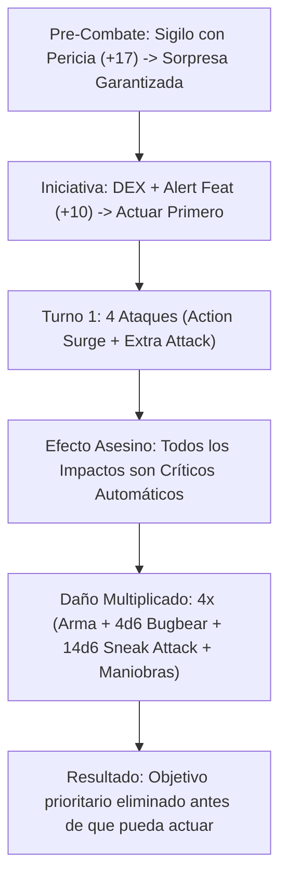

# Resumen General del Personaje: Super Sneaker Life Deleter

## Datos Generales

* **System Standard:** D&D 5th Edition (2014 / 2024 Ruleset)
* **Character Level:** 20 (Rogue [Assassin] 14 / Fighter [Battle Master] 6)
* **Species:** Bugbear (o Humano Variante) [Dote Origen: *Alert* — +5 a la Iniciativa]
* **Background:** Criminal / Guide (+2 DEX, +1 CON)
* **Stats (Point Buy + Background + ASIs):**
  * **STR:** 10 (+0)
  * **DEX:** 20 (+5) *(15 Base + 2 Background + 1 Feat Elven Accuracy / Sharpshooter + 2 ASI Nivel 10)*
  * **CON:** 14 (+2) *(14 Base)*
  * **INT:** 10 (+0)
  * **WIS:** 12 (+1) *(12 Base)*
  * **CHA:** 10 (+0)

Bastión y Tiempo Muerto: ./bastion and downtime.md

### Actual Item List

Actual Item List: ./actual inventory list.md

1. **Shortbow / Longbow (+3) o Hand Crossbow (+3):** Arma principal a distancia.
2. **Bracers of Archery:** +2 al daño de cada ataque realizado con arco.
3. **Cloak of Displacement:** Los enemigos tienen Desventaja en ataques realizados contra el personaje.
4. **Boots of Elvenkind:** Ventaja en pruebas de Sigilo y movimiento silencioso.

---

## Combat Role: Ambush Eraser & First-Turn Nova Striker

### 1. Gestión de Recursos y Reglas de Inventario

* **Economía de Asesinato (Turno 1 Nova):**
  - **Surprise Crits (Rogue Assassin):** Todos los ataques que impacten contra criaturas sorprendidas son **Impactos Críticos automáticos**.
  - **Action Surge (Fighter 2):** Permite realizar 4 ataques en el Turno 1 con la acción de *Extra Attack*.
  - **Surprise Attack (Bugbear):** Añade $+2\text{d}6$ de daño extra por cada ataque que golpee a una criatura que no haya actuado en el combate (al ser crítico, se convierte en $+4\text{d}6$ por impacto).
  - **Mano Abierta / Munción Mágica:** Mantiene al menos una mano libre para recargar su ballesta o arco mágico.

### 2. Action Economy & Combat Loop

* **Pre-combat / Turno 0 Setup:**
  * Prueba de Sigilo con Pericia (*Expertise*) (+17 a Sigilo) para garantizar la sorpresa del objetivo.
* **Turno 1 (Ráfaga Aniquiladora):**
  * **Acción:** 2 Ataques con arco/ballesta con Ventaja.
  * **Action Surge:** 2 Ataques adicionales con arco/ballesta.
  * **Dado de Daño Crítico Automático:** Daño del Arma ($2\text{d}6$) + Bugbear ($4\text{d}6$) + Sneak Attack ($14\text{d}6$) + Superiority Dice ($2\text{d}8$).
  * **Bonus Action:** *Cunning Action* (Hide / Disengage) o ataque extra de *Crossbow Expert*.
* **Turnos 2+ (Hostigamiento y Movilidad):**
  * **Action:** Ataque con ventaja usando Sigilo de *Cunning Action* o Maniobras de Battle Master (*Precision Attack*, *Trip Attack*, *Ambush*).
  * **Reaction:** *Uncanny Dodge* para reducir a la mitad el daño de cualquier ataque recibido.

---

## 3. The META Combo: The First-Turn Ambush Eraser

🧮 Mathematical Engine (D&D 5e (2014 / 2024)):

$$\text{Daño Crítico Turno 1} = 4 \times \left[ 2\text{d}6_{\text{Arma}} + 4\text{d}6_{\text{Bugbear}} + 5_{\text{DEX}} + 2_{\text{Bracers}} + 3_{\text{Item}} \right] + 14\text{d}6_{\text{Sneak Attack}} + 2\text{d}8_{\text{Maniobra}}$$

$$\text{DPR Promedio de Ráfaga (Turno 1)} = 4 \times (7 + 14 + 10) + 49 + 9 = 182\text{ Daño Sostenido Instantáneo}$$

---

## 4. Tabla de Rendimiento Táctico

| Criterio | Valoración | Justificación Mecánica |
| :--- | :---: | :--- |
| **Daño Monobjetivo** | 🔵 | Ráfaga devastadora en el Turno 1 capaz de borrar jefes o enemigos clave antes de su primer turno. |
| **Control de Masas (CC)** | 🔴 | Enfocado 100% en eliminación de objetivos clave; no posee control de área masivo. |
| **Supervivencia (EHP)** | 🟢 | CA 19+, *Uncanny Dodge*, *Evasion* y movimiento constante en Sigilo. |
| **Economía de Acciones** | 🔵 | Explotación máxima de *Action Surge*, *Cunning Action* y Reacciones defensivas. |
| **Sustentabilidad** | 🟢 | Recuperación de *Action Surge* y Dados de Superioridad en descansos cortos. |

---

## 5. Home Rules (Reglas de la Mesa)

1. **Surprise Crits Acumulativos:** Los impactos críticos por sorpresa duplican todos los dados de daño adicionales (incluyendo Bugbear y Sneak Attack).
2. **Reinicio de Sigilo en Combate:** Ocultarse con *Cunning Action* otorga Ventaja inmediata en el siguiente ataque desarmado o a distancia.
