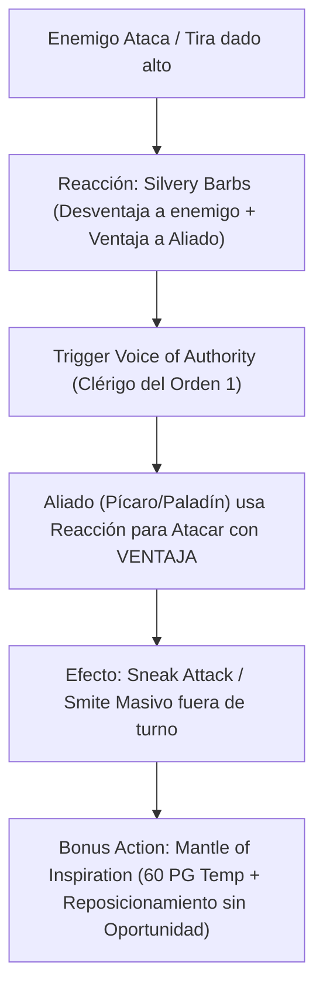

# Resumen General del Personaje: The Conductor

## Datos Generales

* **System Standard:** D&D 5th Edition (2014 Ruleset / 2024 Compatible)
* **Character Level:** 20 (Cleric [Order Domain] 1 / Bard [College of Glamour] 19)
* **Species:** Hobgoblin (*Fortune from the Many*, *Help* Acción: *Spite*)
* **Background:** Entertainer / Musician (Dote: *Inspiring Leader* / *Alert*)
* **Stats (Point Buy + Racial + ASIs):**
  * **STR:** 8 (-1)
  * **DEX:** 14 (+2) *(Límite para Armadura Media)*
  * **CON:** 15 (+2) *(14 Base + 1 ASI — Salud y Concentración)*
  * **INT:** 8 (-1)
  * **WIS:** 13 (+1) *(Requisito de Multiclaseo de Clérigo)*
  * **CHA:** 20 (+5) *(15 Base + 2 Racial + 1 Fey Touched + 2 ASI)*

Bastión y Tiempo Muerto: ./bastion and downtime.md

### Actual Item List

Actual Item List: ./actual inventory list.md

1. **Ollamh Harp / Instrument of the Bards:** Arpa legendaria que impone Desventaja en salvaciones de encantamiento.
2. **Half-Plate (+3) & Sentinel Shield:** Armadura media de grado militar con ventaja en Iniciativa.
3. **Rod of Lordly Might / Reveler's Tambourine:** Foco arcano definitivo de mando.

---

## Combat Role: Full Support Conductor, Reaction Enabler & Tactical Director

### 1. Gestión de Recursos y Reglas de Inventario

* **Voz de Autoridad (Voice of Authority - Order Cleric 1):** Cada vez que lanzas un conjuro de Nivel 1 o superior dirigiéndolo a un aliado (como *Silvery Barbs*, *Healing Word*, *Bless*, *Haste* o *Command*), **ese aliado puede usar inmediatamente su Reacción para realizar un ataque de arma cuerpo a cuerpo o a distancia**.
* **El Combo de Silvery Barbs + Voice of Authority:** 
  1. Un enemigo saca un golpe crítico o tirada alta.
  2. Lanzas *Silvery Barbs* como Reacción: cancelas el éxito del enemigo y le otorgas **Ventaja** al próximo ataque de un aliado (ej. un Picaro o Paladín).
  3. Al haber seleccionado a ese aliado con *Silvery Barbs*, se activa *Voice of Authority*, permitiéndole **atacar inmediatamente con su Reacción teniendo Ventaja** (desatando *Sneak Attack* o *Smite* fuera de su turno).
* **Manto de Inspiración (Mantle of Inspiration - Glamour Bard):** Acción Adicional + 1 Inspiración Bárdica $\rightarrow$ otorga hasta **60 Puntos de Golpe Temporales** a tus aliados y les permite usar su Reacción para moverse hasta su velocidad completa sin provocar ataques de oportunidad.

### 2. Action Economy & Combat Loop

* **Turno 1:**
  * **Action:** Lanza **Bless** o **Haste** sobre los atacantes principales (activa *Voice of Authority* para 1 ataque gratuito inmediato).
  * **Bonus Action:** Activa **Mantle of Inspiration** (reorganiza la posición de todo el equipo en el mapa y otorga PG Temporales).
* **Turno 2+:**
  * **Action:** Utiliza la acción de **Help (Spite - Hobgoblin)** a 5 ft para dar Ventaja a un aliado e imponer Desventaja al próximo ataque del enemigo impactado.
  * **Bonus Action:** *Healing Word* (cura a un aliado caído y le da un ataque inmediato vía *Voice of Authority*).
  * **Reaction:** *Silvery Barbs* (anula ataques enemigos y activa ataques de reacción con Ventaja para tu equipo).

---

## 3. The META Engine: Tactical Reaction Conductor

🧮 Mathematical Engine (D&D 5e):

$$\text{Daño Indirecto por Turno} = \text{DPR del Pícaro/Paladín} \times P(\text{Impacto con Ventaja})$$

$$\text{Mitigación Total} = \text{Aliados} \times \text{PG Temp (hasta 60 PG por Mantle of Inspiration)}$$

---

## 4. Tabla de Rendimiento Táctico

| Criterio | Valoración | Justificación Mecánica |
| :--- | :---: | :--- |
| **Daño Monobjetivo** | 🟡 | Daño propio moderado, pero genera el mayor daño indirecto del equipo al regalar ataques de reacción con Ventaja a aliados. |
| **Control de Masas (CC)** | 🔵 | Control supremo del mapa moviendo aliados sin provocar ataques y usando conjuros bárdicos de masa (*Command*, *Hypnotic Pattern*). |
| **Supervivencia (EHP)** | 🔵 | CA 20+ con armadura media y escudo (gracias al dip de Clérigo), proficiencia en salvaciones de CHA/WIS y escudos temporales. |
| **Economía de Acciones** | 🔵 | Maximiza la economía de acciones del equipo consumiendo las reacciones de los aliados para otorgarles ataques extras. |
| **Sustentabilidad** | 🔵 | Recuperación de Inspiración Bárdica en descansos cortos (*Font of Inspiration*) y regeneración constante de ranuras de Nivel 1. |

---

## 5. Home Rules (Reglas de la Mesa)

1. **Foco Universal Único:** El tamboril o arpa bárdica actúa como foco unificado para conjuros de Clérigo y Bardo.
2. **Progresión Full Caster Integrada:** Nivel de lanzador 20 completo (1 Clérigo + 19 Bardo).
