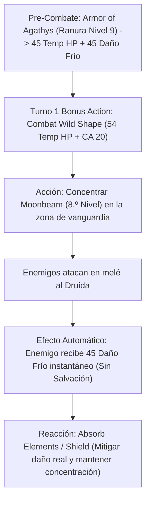

# Resumen General del Personaje: The Cursed Moon Druid

## Datos Generales

* **System Standard:** D&D 5th Edition (2024 / 5.5e Update)
* **Character Level:** 20 (Druid [Circle of the Moon] 18 / Warlock [Fiend] 1 / Cleric [Twilight Domain] 1)
* **Species:** Human (Origin Feat: *Magic Initiate [Warlock]* — *Armor of Agathys*, *Eldritch Blast*, *Toll the Dead*)
* **Background:** Guide (+2 WIS, +1 CON)
* **Stats (Point Buy + Background + ASIs):**
  * **STR:** 8 (-1) *(Point Buy)*
  * **DEX:** 14 (+2) *(Point Buy)*
  * **CON:** 16 (+3) *(15 Base + 1 Resilient CON)*
  * **INT:** 8 (-1) *(Point Buy)*
  * **WIS:** 20 (+5) *(15 Base + 2 Background + 2 ASI Nivel 8 + 1 Telekinetic Nivel 12)*
  * **CHA:** 13 (+1) *(Requisito de Multiclase Warlock)*

Bastión y Tiempo Muerto: ./bastion and downtime.md

### Actual Item List

Actual Item List: ./actual inventory list.md

1. **Moon Sickle (+3):** Canalizador druídico primordial. Añade +3 a las tiradas de ataque con conjuros y a la CD de salvación de conjuros de Druida, además de otorgar $1\text{d}4$ adicional a los conjuros de curación.
2. **Cloak of Protection:** +1 a la Clase de Armadura y +1 a todas las Tiradas de Salvación.
3. **Ring of Protection:** +1 a la Clase de Armadura y +1 a todas las Tiradas de Salvación.
4. **Insignia of Claws (Sin sintonización):** Convierte los ataques desarmados y de Forma Salvaje en mágicos con un bonificador de +1 al impacto y daño.

---

## Combat Role: Vanguard Tank, Cold Retaliation Striker & Battlefield Dominator

### 1. Gestión de Recursos y Reglas de Inventario

* **Foco Universal Único (Regla de Mesa):** Un único símbolo sagrado druídico canaliza todos los conjuros de Druida, Warlock y Clérigo. Esto elimina las restricciones de manos libres o componentes somáticos tanto en forma humanoide como durante la **Forma Salvaje (Wild Shape)**.
* **Progresión Full Caster Integrada (Regla de Oro):** Con 18 niveles de Druida, 1 de Warlock y 1 de Clérigo, la suma de niveles de lanzador es **20**. El personaje dispone del árbol completo de espacios de conjuro de nivel 1 a 9 y puede preparar conjuros de nivel 9 de Warlock (*Armor of Agathys*) y Clérigo.
* **Bucle Retorcido de Puntos de Golpe Temporales (*Armor of Agathys* + *Combat Wild Shape*):**
  - Al lanzar *Armor of Agathys* con una ranura de 9.º nivel antes o al inicio del combate, el Druida obtiene **45 Puntos de Golpe Temporales** y devuelve **45 de daño de frío automático** (sin salvación) a cualquier enemigo que le golpee con un ataque cuerpo a cuerpo.
  - En las reglas de 2024, la *Forma Salvaje del Círculo de la Luna* se activa como **Acción Adicional** y otorga **54 Puntos de Golpe Temporales** adicionales (3 × Nivel de Druida) y una CA base de $13 + \text{Mod. Sabiduría} = 18$ CA (o 20 CA con objetos mágicos).

### 2. Action Economy & Combat Loop

* **Pre-combat / Turno 0 Setup:**
  * **Lanzamiento:** *Armor of Agathys* a 9.º Nivel (45 Temp HP + 45 Daño Frío de Venganza).
* **Turno 1 Setup:**
  * **Bonus Action:** Activa *Combat Wild Shape* (Transformación en Gran Felino / Bestia Elemental). Obtiene 54 Temp HP de Forma Salvaje y CA 20.
  * **Action:** Lanzar *Moonbeam* de 8.º Nivel o realizar la ráfaga de ataques cuerpo a cuerpo de la Forma Salvaje (convertidos a daño radiante en 2024).
* **Turno 2+ (Bucle de Castigo de Venganza):**
  * **Movement / Action:** Atacar en melé forzando a los enemigos a responder. Cualquier enemigo que golpee al Druida en melé recibe 45 de daño de frío instantáneo sin tirada de salvación.
  * **Bonus Action:** Telekinesis (mover enemigos 5 ft hacia áreas de *Moonbeam* o *Spike Growth*) o reconvertir ranuras en Puntos de Golpe de Forma Salvaje.
  * **Reaction:** *Absorb Elements* (mitigar daño elemental recibido) o *Shield* / *Counterspell* según la situación.

---

## 3. The META Combo: El Motor Maldito de Agathys Aéreo

🧮 Mathematical Engine (D&D 5e (2024 / 5.5e)):

$$\text{Daño de Venganza Automático} = N_{\text{Impactos melé recibidos}} \times 45_{\text{Daño Frío (Agathys Nivel 9)}}$$

$$\text{DPR Sostenido en Forma Salvaje} = 2 \times \left[ P(\text{Hit}) \times (2\text{d}8_{\text{Bestia}} + 5_{\text{WIS}} + 1_{\text{Insignia}}) \right] + P(\text{Moonbeam}) \times 8\text{d}10_{\text{Radiante}}$$

$$\text{Pool Total de EHP Inicial} = 153_{\text{HP Base}} + 45_{\text{Temp HP (Agathys)}} + 54_{\text{Temp HP (Wild Shape)}} = 252\text{ EHP de Entrada}$$

---

## 4. Tabla de Rendimiento Táctico

| Criterio | Valoración | Justificación Mecánica |
| :--- | :---: | :--- |
| **Daño Monobjetivo** | 🔵 | *Armor of Agathys* de nivel 9 devuelve 45 de daño de frío por golpe sin salvación, sumado a los ataques desarmados radiantes y *Moonbeam*. |
| **Control de Masas (CC)** | 🟢 | Acceso al catálogo completo de conjuros de control de campo del Druida (*Spike Growth*, *Wall of Thorns*, *Reverse Gravity*) reforzados con CD +3 por *Moon Sickle*. |
| **Supervivencia (EHP)** | 🔵 | EHP astronómico combinando la reserva de vida de Forma Salvaje 2024, *Armor of Agathys*, *Absorb Elements* y salvaciones de Constitución con Ventaja. |
| **Economía de Acciones** | 🔵 | Transformación y telequinesis en Acción Adicional, hechizos pesados en Acción principal y mitigación/cancelación en Reacción. |
| **Sustentabilidad** | 🔵 | Recuperación de usos de Forma Salvaje en descansos cortos y capacidad de regenerar recursos con la regla de Progresión Full Caster. |

---

## 5. Home Rules (Reglas de la Mesa)

1. **Foco Universal Único:** No requiere componentes somáticos o materiales sencillos para conjuros de Druida, Warlock o Clérigo mientras porte el *Moon Sickle* o símbolo druídico.
2. **Progresión Full Caster Integrada:** Nivel de lanzador total unificado de 20. Permite preparar *Armor of Agathys* como conjuro de 9.º nivel.
