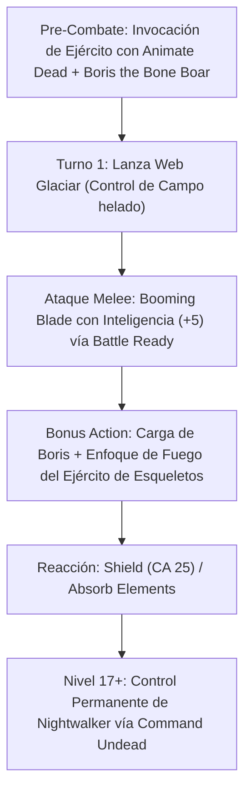

# Resumen General del Personaje: Death Knight

## Datos Generales

* **System Standard:** D&D 5th Edition (2014 Ruleset / 2024 Compatible)
* **Character Level:** 20 (Artificer [Battle Smith] 3 / Wizard [School of Necromancy] 17)
* **Species:** Reborn (Reborn Lineage — *Ancestral Legacy*, *Deathless Nature*)
* **Background:** Knight / Soldier (Dote: *Tough* / *War Caster*)
* **Stats (Point Buy + Racial + ASIs):**
  * **STR:** 10 (+0)
  * **DEX:** 14 (+2) *(Límite para Armadura Media)*
  * **CON:** 15 (+2) *(14 Base + 1 ASI — Proficiencia en Salvaciones de CON)*
  * **INT:** 20 (+5) *(15 Base + 2 Racial + 1 Fey Touched + 2 ASI)*
  * **WIS:** 10 (+0)
  * **CHA:** 8 (-1)

Bastión y Tiempo Muerto: ./bastion and downtime.md

### Actual Item List

Actual Item List: ./actual inventory list.md

1. **Greatsword of the Damned / Flame Tongue (+3 INT Focus):** Arma a dos manos que canaliza ataques con Inteligencia gracias a *Battle Ready*.
2. **Plate Armor of Resistance / Half-Plate (+3):** Armadura de grado militar infusionada.
3. **Staff of the Magi / Arcane Focus:** Foco arcano definitivo para conjuración nigromántica.
4. **Boris The Bone Boar:** Defensor de Acero (*Steel Defender*) personalizado como un jabalí óseo nigromántico.

---

## Combat Role: Frontline Gish Tank, Undead Army Commander & Glacial Controller

### 1. Gestión de Recursos y Reglas de Inventario

* **Ataques con Inteligencia (Battle Ready):** Al usar un arma mágica (o infusionada), atacas y calculas el daño utilizando tu modificador de **Inteligencia (+5)** en lugar de Fuerza o Destreza.
* **Economía de Ranuras y Lanzamiento Spammable:** Espacios de Nivel 1 dedicados a *Shield*, *Absorb Elements* y *Silvery Barbs*. Espacios de Nivel 2 para control glaciar (*Web*, *Blur*, *Vortex Warp*). Espacios de Nivel 3 en adelante dedicados al alzamiento y mantenimiento del ejército de muertos vivientes (*Animate Dead*).
* **Mando de Muertos Vivientes (Command Undead - Nivel 17):** Control permanente e incondicional sobre un Muerto Viviente de alto nivel como un **Nightwalker** o **Mummy Lord**.

### 2. Action Economy & Combat Loop

* **Pre-combat:** Invoca tu ejército con *Animate Dead*, monta a tu corcel espectral (*Phantom Steed*), sintoniza a *Boris the Bone Boar*.
* **Turno 1:**
  * **Action:** Lanza **Web** (re-saborizado como escarcha y cristales de hielo helados) o embiste en melé con *Booming Blade* / *Green-Flame Blade*.
  * **Bonus Action:** Ordena a Boris the Bone Boar y al ejército de esqueletos atacar al objetivo inmovilizado.
* **Turno 2+:**
  * **Action:** Ataque de arma con Inteligencia + *Booming Blade* ($4\text{d}8$ daño trueno extra) o conjuro de muerte/área.
  * **Bonus Action:** Ataque de empujón de Boris o *Misty Step*.
  * **Reaction:** *Shield* (CA 23-25), *Absorb Elements* o *Silvery Barbs*.

---

## 3. The META Combo: Glacial Frostbite & Nightwalker Frontline

🧮 Mathematical Engine (D&D 5e):

$$\text{DPR Melee + Ejército} = P(\text{Hit}) \times \left[ (2\text{d}6 + 5_{\text{INT}} + 3_{\text{Item}}) + 3\text{d}8_{\text{Booming}} \right] + \sum \text{Daño Esqueletos Boosted (Undead Thralls)}$$

$$\text{Vida Extra Esbirros} = \text{Nivel de Mago (17) en PG adicionales por esqueleto}$$

---

## 4. Tabla de Rendimiento Táctico

| Criterio | Valoración | Justificación Mecánica |
| :--- | :---: | :--- |
| **Daño Monobjetivo** | 🟢 | Combina ataques de espadón con Inteligencia + *Booming Blade* y el daño concentrado de 8+ esqueletos potenciados. |
| **Control de Masas (CC)** | 🟢 | Control de hielo con *Web*, *Vortex Warp*, *Maximilian's Grasp* y el control definitivo sobre un *Nightwalker*. |
| **Supervivencia (EHP)** | 🔵 | CA 23-25 con *Shield*, proficiencia en salvaciones de CON, curación vampírica (*Grim Harvest*) y *Defensor de Acero*. |
| **Economía de Acciones** | 🔵 | Uso continuo de Acción, Acción Adicional (Boris/Esbirros) y Reacciones spammables (*Shield*/*Absorb Elements*). |
| **Sustentabilidad** | 🟢 | Recuperación de ranuras con *Arcane Recovery* y vida constante recuperada al matar enemigos con hechizos de nigromancia. |

---

## 5. Home Rules (Reglas de la Mesa)

1. **Foco Universal Único:** Utiliza su espadón infusionado o tomo arcano como foco universal para conjuros de Artífice y Mago.
2. **Progresión Full Caster Integrada:** Nivel de lanzador 18 para la tabla de espacios de conjuro.
