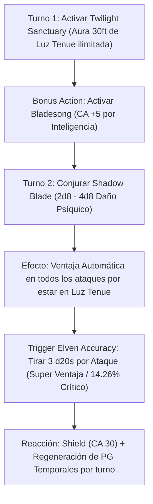

# Resumen General del Personaje: Shadow Mage

## Datos Generales

* **System Standard:** D&D 5th Edition (2014 Ruleset / 2024 Compatible)
* **Character Level:** 20 (Cleric [Twilight Domain] 2 / Wizard [Bladesinger] 18)
* **Species:** High Elf (*Fey Ancestry*, *Trance*, *Cantrip Extra*, *Elven Accuracy*)
* **Background:** Hermit / Outlander (Dote: *Elven Accuracy* / *Fey Touched*)
* **Stats (Point Buy + Racial + ASIs):**
  * **STR:** 8 (-1)
  * **DEX:** 20 (+5) *(15 Base + 2 Racial + 1 Dote Elven Accuracy + 2 ASI)*
  * **CON:** 14 (+2)
  * **INT:** 20 (+5) *(14 Base + 1 Racial + 1 ASI + 2 ASI)*
  * **WIS:** 13 (+1) *(Requisito de Multiclaseo de Clérigo)*
  * **CHA:** 8 (-1)

Bastión y Tiempo Muerto: ./bastion and downtime.md

### Actual Item List

Actual Item List: ./actual inventory list.md

1. **Rapier of the Shadow Blade (+3 / Arcane Focus):** Estoque arcano para combinar con *Bladesinger Extra Attack*.
2. **Studded Leather Armor (+3):** Armadura de cuero tachonado mística.
3. **Robes of the Archmagi / Cloak of Displacement:** CA 15 + DEX 5 + INT 5 (Bladesong) = CA 25 base (+5 con *Shield* = **CA 30**).
4. **Shadow Familiar / Summoned Shadow Spawn:** Sombra familiar que se camufla dentro del aura de Luz Tenue.

---

## Combat Role: Frontline Evasion Gish, Triple-Advantage Striker & Twilight Shadow Controller

### 1. Gestión de Recursos y Reglas de Inventario

* **El Motor de Luz Tenue Permanente (Twilight Sanctuary + Shadow Blade):** Tu *Channel Divinity* (*Twilight Sanctuary*) crea un aura de 30 pies de **Luz Tenue** constante a tu alrededor, sin importar la iluminación exterior. Al conjurar **Shadow Blade** ($2\text{d}8$ a $5\text{d}8$ de daño psíquico), obtienes **Ventaja constante en todos los ataques** por estar en Luz Tenue.
* **Súper Ventaja con Elven Accuracy:** Gracias a la dote **Elven Accuracy**, cada tirada de ataque con Ventaja basada en Destreza o Inteligencia te permite tirar **3 d20s en lugar de 2**, elevando la probabilidad de impacto al $\sim 98.7\%$ y la probabilidad de Crítico al $14.26\%$ por ataque.
* **Bladesinger Extra Attack Versátil:** A partir de Nivel 6 de Mago (Nivel 8 Total), puedes reemplazar uno de tus ataques por un Cantrip (*Booming Blade*, *Green-Flame Blade* o *Ray of Frost*), desatando un volumen de daño colosal.
* **Defensas Imparables (Bladesong + Twilight Temp HP):** La *Bladesong* suma tu Inteligencia (+5) a la CA y a las salvaciones de concentración. En cada turno, *Twilight Sanctuary* otorga $1\text{d}6 + 2$ Puntos de Golpe Temporales renovables a ti y a tus aliados/invocaciones.

### 2. Action Economy & Combat Loop

* **Pre-combat / Turno 1 Setup:**
  * **Action:** Activa **Twilight Sanctuary** (Canalizar Divinidad — crea el aura de 30 ft de Luz Tenue y regeneración de PG Temporales).
  * **Bonus Action:** Activa **Bladesong** (CA sube a 25+, +10 ft velocidad, bonus a concentración).
* **Turno 2 (El Despliegue de las Sombras):**
  * **Bonus Action:** Lanza **Shadow Blade** (Nivel 2 o 4) o invoca **Summon Shadow Spawn** (Sombra de Miedo).
  * **Action:** Ataques con **Triple Ventaja (Elven Accuracy)** inflando daño psíquico ($2\text{d}8$ a $4\text{d}8$) + *Booming Blade*.
* **Turno 3+:**
  * **Action:** Ataque 1 con *Shadow Blade* ($3\text{d}20$ dados con Ventaja) + Ataque 2 cantrip *Booming Blade*.
  * **Reaction:** *Shield* (CA 30), *Absorb Elements* o *Silvery Barbs*.

---

## 3. The META Combo: Twilight Sanctuary + Shadow Blade + Elven Accuracy

🧮 Mathematical Engine (D&D 5e):

$$\text{P(Impacto con Elven Accuracy)} = 1 - (1 - P)^3 \approx 98.7\%$$

$$\text{DPR Triple-Advantage} = 2 \times \left[ P(\text{Hit}_{3\text{d}20}) \times (3\text{d}8_{\text{Shadow Blade}} + 5_{\text{DEX}}) + P(\text{Crit}) \times (3\text{d}8) \right] + 3\text{d}8_{\text{Booming}}$$

---

## 4. Tabla de Rendimiento Táctico

| Criterio | Valoración | Justificación Mecánica |
| :--- | :---: | :--- |
| **Daño Monobjetivo** | 🔵 | Ataques de *Shadow Blade* con $3\text{d}20$ de Súper Ventaja constante, críticos frecuentes y daño psíquico escalado. |
| **Control de Masas (CC)** | 🟢 | Control de oscuridad/luz tenue, ralentización con *Ray of Frost*, *Summon Shadow Spawn* y conjuros bárdicos/arcanos. |
| **Supervivencia (EHP)** | 🔵 | CA 25 base (30 con *Shield*), ventaja en concentración, PG temporales automáticos cada turno y resistencia a encantos. |
| **Economía de Acciones** | 🔵 | Uso fluido de Acción Adicional (*Bladesong* / *Shadow Blade*), Reacción (*Shield*) y Extra Attack con Cantrip. |
| **Sustentabilidad** | 🟢 | Recuperación de *Bladesong* y *Canalizar Divinidad* en descansos cortos, más *Arcane Recovery*. |

---

## 5. Home Rules (Reglas de la Mesa)

1. **Foco Universal Único:** El estoque o símbolo de la sombra canaliza todos los hechizos de Clérigo y Mago.
2. **Progresión Full Caster Integrada:** Nivel de lanzador 19 unificado para espacios de conjuro.
