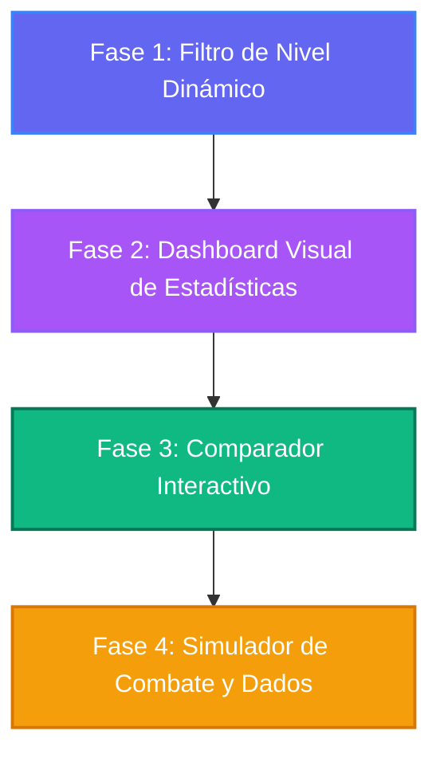

# 💡 Ideas de Mejora para D&D Character Build Archivist

Este documento detalla las ideas de mejora propuestas para el proyecto **D&D Character Build Archivist**, ordenadas de acuerdo a su viabilidad de implementación, menor fricción técnica y mayor impacto en la experiencia del usuario (UX/UI).

---

## 📅 Roadmap de Implementación Recomendado

A continuación se propone el orden de implementación. Se priorizan las mejoras que enriquecen los datos existentes antes de añadir simuladores complejos.

---

## 🛠️ Detalle de las Ideas Propuestas

### Fase 1: 🎚️ Filtro de Nivel Dinámico (Slider 1-20)

- **Descripción:** Añadir un slider deslizante en la barra de detalles para permitir que el usuario visualice la build a un nivel específico.
- **Detalles Técnicos:**
  - **UI/UX:** Un slider deslizante del 1 al 20 en la cabecera del visor de detalles que cambie de color según la clase principal del personaje.
  - **Hoja de Ruta (`roadmap.md`):** Cuando la pestaña de progresiones esté activa, ocultará dinámicamente las filas de la tabla correspondientes a niveles superiores al seleccionado y resaltará la fila del nivel actual.
  - **Control de Recursos (Session Tracker):** En lugar de mostrar los espacios de conjuro y recursos de nivel 20 por defecto, parseará la composición de clases a ese nivel del archivo `roadmap.md` para actualizar la cuadrícula de recursos de forma interactiva.
- **Impacto:** 🔵 **Roto/Indispensable**. Convierte las guías de texto estático en una herramienta viva de referencia de campaña en mesa.

### Fase 2: 🕸️ Dashboard Visual de Estadísticas (Radar Chart)

- **Descripción:** Reemplazar el panel de bienvenida o el panel superior con un gráfico de radar (spider chart) interactivo que muestre el perfil de la build.
- **Detalles Técnicos:**
  - **UI/UX:** Renderizar un SVG dinámico con bordes suaves y rellenos translúcidos que represente cinco métricas de optimización: 1. **DPR (Daño por Asalto)** 2. **EHP (Puntos de Vida Efectivos / Tanque)** 3. **Control de Masas** 4. **Soporte / Utilidad** 5. **Complejidad en Mesa**
  - **Datos:** Añadir un campo `"ratings": {"dpr": 8, "ehp": 7, ...}` a cada objeto de build en [builds.json](file:///d:/repo-vault/Rol/DnDbuilds/builds.json).
- **Impacto:** 🟢 **Excelente/Fuerte**. Aporta un enorme valor visual ("wow factor") y ayuda a los jugadores a elegir una build basándose en su estilo de juego preferido.

### Fase 3: 📊 Comparador Interactivo de Builds (Lado a Lado)

- **Descripción:** Permitir al usuario seleccionar varias builds desde el panel lateral y compararlas lado a lado.
- **Detalles Técnicos:**
  - **UI/UX:** Añadir checkboxes discretos a las tarjetas de build del menú lateral. Si se seleccionan 2 o más, aparece un botón de "Comparar". Al hacer clic, se abre una vista comparativa con una tabla interactiva de características y un gráfico SVG comparativo superpuesto.
  - **Modelado:** Aprovecha los campos de clasificación ya cargados para estructurar la comparativa de forma rápida.
- **Impacto:** 🟢 **Excelente/Fuerte**. Facilita la toma de decisiones al crear personajes, especialmente para campañas de alta optimización o "one-shots".

### Fase 4: 🎲 Simulador de Combate y Dados Integrado

- **Descripción:** Añadir un panel flotante o pestaña interactiva que permita al usuario realizar los ataques matemáticos y el DPR del personaje.
- **Detalles Técnicos:**
  - **UI/UX:** Un panel o pestaña que muestre las acciones típicas de combate del personaje (ej: _Eldritch Blast_, _Martillo de Guerra + Divine Smite_). El usuario puede ingresar la CA de un enemigo y hacer clic para "Atacar".
  - **Lógica:** Calculará de forma simulada la probabilidad de impacto (incluyendo ventajas/desventajas y dotes como _Elven Accuracy_) y mostrará el log del daño promedio con pequeñas animaciones CSS de dados.
- **Impacto:** 🟡 **Decente/Aceptable**. Es divertido de probar y valida empíricamente los cálculos teóricos expuestos en las guías matemáticas en LaTeX.
