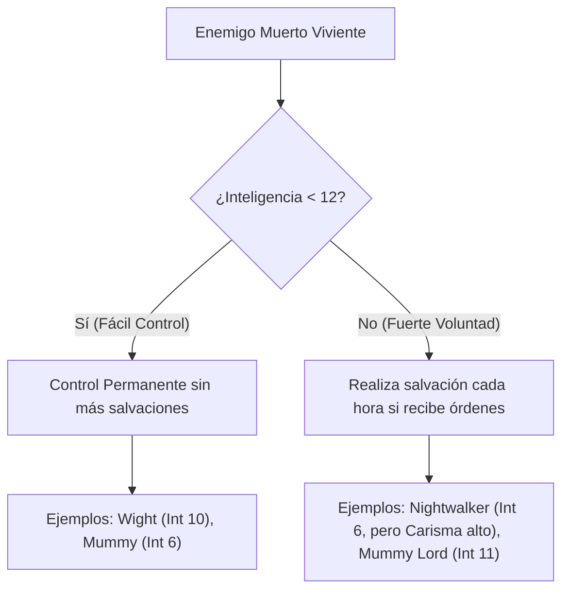

# 💀 Hoja de Ruta del Convocador de Espíritus (Nivel 1 - 20)

Esta hoja de ruta detalla la progresión nivel a nivel para el **Spirit Caller** (Mago Nigromante Reborn), optimizada según las reglas de **D&D 5.ª Edición (2024 / 5.5e)**. El build se enfoca en el control del campo de batalla desde el aire, la optimización de esbirros invocados y la protección absoluta de la concentración.

---

## 📊 Tabla de Progresión Completa (1 - 20)

| Nivel | PB | Características de Clase / Subclase | Dotes y Atributos | Conjuros Preparados | Ranuras de Conjuro por Nivel (1.º a 9.º) |
| :---: | :---: | :--- | :--- | :---: | :--- |
| **1** | +2 | Recuperación Arcana, Adepto de Rituales | Magic Initiate (Cleric) | 4 | 2, —, —, —, —, —, —, —, — |
| **2** | +2 | Erudito (Scholar - Pericia) | — | 5 | 3, —, —, —, —, —, —, —, — |
| **3** | +2 | Subclase (Grim Harvest, Nigromancia Savant) | — | 6 | 4, 2, —, —, —, —, —, —, — |
| **4** | +2 | — | **War Caster** (INT 18) | 7 | 4, 3, —, —, —, —, —, —, — |
| **5** | +3 | Memorizar Conjuro (Memorize Spell) | — | 9 | 4, 3, 2, —, —, —, —, —, — |
| **6** | +3 | **Undead Thralls** (Esbirros Nigrománticos) | — | 10 | 4, 3, 3, —, —, —, —, —, — |
| **7** | +3 | — | — | 11 | 4, 3, 3, 1, —, —, —, —, — |
| **8** | +3 | — | **ASI** (+2 INT -> **INT 20**) | 12 | 4, 3, 3, 2, —, —, —, —, — |
| **9** | +4 | — | — | 14 | 4, 3, 3, 3, 1, —, —, —, — |
| **10** | +4 | **Inured to Death** (Resistencia Necrótica) | — | 15 | 4, 3, 3, 3, 2, —, —, —, — |
| **11** | +4 | — | — | 15 | 4, 3, 3, 3, 2, 1, —, —, — |
| **12** | +4 | — | **Resilient (CON)** o **Lightly Armored** | 16 | 4, 3, 3, 3, 2, 1, —, —, — |
| **13** | +5 | — | — | 16 | 4, 3, 3, 3, 2, 1, 1, —, — |
| **14** | +5 | **Command Undead** (Comandar Muerto Viviente) | — | 17 | 4, 3, 3, 3, 2, 1, 1, —, — |
| **15** | +5 | — | — | 17 | 4, 3, 3, 3, 2, 1, 1, 1, — |
| **16** | +5 | — | **Lightly Armored**, **Resilient** o **Alert** | 18 | 4, 3, 3, 3, 2, 1, 1, 1, — |
| **17** | +6 | — | — | 18 | 4, 3, 3, 3, 2, 1, 1, 1, 1 |
| **18** | +6 | **Spell Mastery** (1.º y 2.º nivel a voluntad) | — | 19 | 4, 3, 3, 3, 3, 1, 1, 1, 1 |
| **19** | +6 | — | **Epic Boon of Spell Recall** (INT 21) | 19 | 4, 3, 3, 3, 3, 2, 1, 1, 1 |
| **20** | +6 | **Signature Spells** (Dos conjuros de 3.º gratis) | — | 20 | 4, 3, 3, 3, 3, 2, 2, 1, 1 |

---

## 🎯 Progresión de Dotes (Feats) y Atributos

Las dotes elegidas equilibran la ofensiva mágica y la invulnerabilidad en combate (concentración y CA):

1.  **Nivel 1 (Trasfondo Acólito): Magic Initiate (Cleric)**
    *   *Trucos:* `Guidance` (reacción de soporte rota en 2024), `Spare the Dying` (utilidad temática).
    *   *Conjuro de Nivel 1:* `Bless` (Concentración). Imprescindible para bufar el ataque y las salvaciones de tu batería de esqueletos.
2.  **Nivel 4: War Caster (Dote General - Media Dote)**
    *   *Efecto:* +1 INT (alcanzando 18). Otorga **Ventaja en tiradas de salvación de Constitución para mantener Concentración**, te permite usar reacciones para lanzar conjuros en vez de ataques de oportunidad, y realizar componentes somáticos con las manos ocupadas (útil al empuñar un escudo).
3.  **Nivel 8: Ability Score Improvement (ASI)**
    *   *Efecto:* **+2 INT (alcanzando 20)**. Maximiza la CD de tus salvaciones (16 a este nivel) y tus ataques de conjuro (+8). Tus esbirros invocados con *Summon Undead* escalan directamente con tu CD de conjuro.
4.  **Nivel 12: Resilient (Constitution) [Recomendado]**
    *   *Efecto:* +1 CON (alcanzando 15). Otorga **Competencia en salvaciones de Constitución** (incluyendo concentración). 
    *   *Nota de Sintonía:* Si ya posees el **Amulet of Health** (que fija tu Constitución en 19, modificador +4), este bonificador de competencia se suma directamente a ese +4, dándote un bonificador total de **+8 a +10** en concentración.
5.  **Nivel 16: Lightly Armored (Dote General - Media Dote)**
    *   *Efecto:* +1 DEX (alcanzando 15) o +1 STR. Otorga **Competencia en Armadura Ligera y Escudos**.
    *   *Utilidad:* Te permite equipar un **Shield (+2 CA)** de manera efectiva sin restringir tus conjuros. Al empuñar un escudo común (o el *Spellguard Shield* de Tier 3) y usar *Mage Armor*, tu CA permanente sube de 15 a **17** (y hasta **22** al usar la reacción de *Shield*).
6.  **Nivel 19 (Epic Boon): Boon of Spell Recall**
    *   *Efecto:* **+1 INT (alcanzando 21)**. Cuando lanzas un conjuro de nivel 1 a 4, tiras un $1d4$. Si el resultado es igual al nivel del conjuro, **no consumes la ranura**. Esto da un 25% de probabilidad de lanzar gratis conjuros esenciales de combate como *Bless* (1.º), *Web* (2.º), *Animate Dead* (3.º) o *Summon Undead* (4.º).
    *   *Alternativa:* **Boon of Dimensional Travel** si prefieres teleportarte 30 pies gratis cada vez que realizas la acción de Magia.

---

## 🔮 Selección Clave de Conjuros por Niveles (7 - 20)

Cada vez que subes de nivel de Mago, agregas dos conjuros gratis a tu libro. Prioriza los siguientes según el nivel alcanzado:

### 🔴 Niveles 7 - 10 (Tier 2)
*   **Nivel 7:**
    *   `Summon Undead` (Upcast a 4.º nivel): Invoca al esbirro con 2 ataques por turno. La versión *Putrid* realiza 2 garras venenosas que pueden paralizar.
    *   `Dimension Door`: Teletransportación táctica de emergencia de hasta 500 pies para ti y un aliado.
*   **Nivel 8:**
    *   `Banishment`: Envía a un enemigo a otro plano (salvación de Carisma, ideal contra monstruos no nativos).
    *   `Polymorph`: Convierte a un aliado moribundo en un Tiranosaurio Rex (136 HP gratis) o a un enemigo en un caracol.
*   **Nivel 9:**
    *   `Wall of Force`: Control absoluto sin salvación. Separa a los jefes de sus esbirros o enciérralos en una burbuja indestructible mientras tus arqueros limpian el resto.
    *   `Danse Macabre`: (Concentración). Anima hasta 5 cadáveres cercanos como esqueletos. Cada esqueleto obtiene un bonificador a sus tiradas de ataque y daño igual a tu modificador de Inteligencia (+5). Con *Undead Thralls* y *Bless*, su DPR es devastador.
*   **Nivel 10:**
    *   `Synaptic Static`: Daño psíquico en área equivalente a *Fireball*, pero requiere salvación de INT y reduce en $1d6$ los ataques y pruebas de los afectados durante 1 minuto (sin concentración).
    *   `Hold Monster`: Paraliza a cualquier criatura (salvación de Sabiduría). Tus esbirros tienen impactos críticos automáticos cuerpo a cuerpo contra el objetivo.

### 🟣 Niveles 11 - 16 (Tier 3)
*   **Nivel 11:**
    *   `Create Undead` (6.º nivel): Crea 3 Ghouls (Necrófagos) bajo tu control que pueden paralizar al impactar. Tus bonificadores de nigromante (*Undead Thralls*) les otorgan $+11$ HP y $+4$ al daño.
    *   `Globe of Invulnerability`: Barrera inmóvil que bloquea todos los conjuros de nivel 5 o menor. Excelente para duelos contra magos enemigos.
*   **Nivel 12:**
    *   `Disintegrate`: Daño masivo de fuerza por si necesitas desintegrar una barrera de energía o evaporar a un enemigo clave.
    *   `Contingency`: (Ritual). Configura un conjuro (como *Dimension Door* o *Misty Step*) para que se active automáticamente bajo una condición (ej: "cuando mi vida caiga por debajo de 15 puntos" o "cuando sea inmovilizado").
*   **Nivel 13:**
    *   `Simulacrum`: Crea un clon de hielo y nieve con la mitad de tu vida pero con todos tus espacios de conjuro y rasgos. **Duplica tu ejército**: tu simulacro puede lanzar su propio *Animate Dead* y concentrarse en *Bless*, mientras tú mantienes *Summon Undead*.
    *   `Forcecage`: La versión definitiva de *Wall of Force*. Encierra a cualquier criatura que quepa en un cubo de 20 pies sin tirada de salvación y dura 1 hora sin requerir concentración.
*   **Nivel 14 (Comandar Muertos Vivientes):**
    *   `Finger of Death`: Daño necrótico masivo. Si mata a un humanoide, se alza permanentemente como zombi bajo tu mando.
    *   `Plane Shift`: Viaje interdimensional o destierro definitivo de un enemigo al Plano del Fuego.
*   **Nivel 15:**
    *   `Maze`: Destierra a un objetivo sin salvación inicial al laberinto de un plano de bolsillo. Requiere una acción para realizar una prueba de INT CD 20 para escapar.
    *   `Mind Blank`: Duración 24 horas (sin concentración). Inmunidad al daño psíquico, lectura de mente y al estado encantado. Lánzalo al iniciar el día en ti o tu simulacro.
*   **Nivel 16:**
    *   `Clone`: Crea un clon inerte en tu base. Si mueres, tu alma viaja instantáneamente al clon, garantizando la inmortalidad táctica.
    *   `Abi-Dalzim's Horrid Wilting`: Gran daño necrótico en área que deshidrata a tus enemigos.

### 🟠 Niveles 17 - 20 (Tier 4)
*   **Nivel 17:**
    *   `Wish`: Duplica cualquier conjuro de nivel 8 o menor de cualquier lista de clase con 1 sola acción, ignorando sus costes en componentes y tiempo de lanzamiento (por ejemplo, puedes lanzar un *Simulacrum* instantáneo o un *Find Familiar* en mitad de un combate).
    *   `Shapechange`: Conviértete en un Dragón de Oro Adulto o un Pit Fiend (Diablo del Foso) manteniendo tus estadísticas mentales y tus rasgos de clase (¡incluyendo el control de tus muertos vivientes!).
*   **Niveles 18 - 20:**
    *   Completa tu libro con conjuros de utilidad masiva como `Foresight` (ventaja en todo durante 8 horas) o `Time Stop`.

---

## ⚡ Combos y Estrategias del META

### 1. El Combo de Concentración Inquebrantable (Unbreakable Concentration)
Al luchar montado en tu **Flying Broom**, mantener la concentración es un asunto de vida o muerte. Si pierdes la concentración en el aire por recibir daño, no solo pierdes tus bufos tácticos, sino que corres el riesgo de caer.
*   **La Fórmula:** Constitución 19 (vía *Amulet of Health*) + *Resilient (CON)* (Competencia en salvaciones) + *War Caster* (Ventaja en salvaciones de concentración).
*   **El Resultado (Nivel 13+):** Tu modificador a las salvaciones de Constitución es **+9 con Ventaja** (+4 CON +5 Competencia). El daño mínimo para requerir una salvación es de 21 puntos o menos (lo que genera una CD 10 estándar). Como un resultado de 1 en el dado con un +9 da un total de 10, y las salvaciones no fallan automáticamente con un 1 natural en D&D 2024, **es matemáticamente imposible fallar una salvación de concentración estándar**.
*   **Sinergia con el Anillo del Pastor de Almas:** Si sufres un impacto masivo que eleva la CD de concentración (ej. 40 de daño = salvación CD 20), puedes usar tu **Reacción** para redirigir la mitad del daño a uno de tus esqueletos cercanos. Esto reduce el daño sufrido a 20, bajando la CD de la salvación de concentración a un manejable 10 (la cual pasas automáticamente).

### 2. El Combo "Ceguera Silenciosa" (Blindness + Skeletons Battery)
*   **Turno 1:** Lanzas `Web` (Acción) en una zona con enemigos. Ordenas a tus esqueletos (Acción Adicional) disparar a las criaturas atrapadas (*Restrained*). Tus esqueletos atacarán con **Ventaja** y el enemigo tendrá desventaja al atacarte a distancia.
*   **Turno 2+:** Lanzas `Blindness/Deafness` (2.º nivel) sobre el objetivo que no cayó en la telaraña. Como **no requiere concentración**, puedes mantener activo tu conjuro de *Web* o tu *Summon Undead*. Una criatura cegada otorga **Ventaja** a todos los ataques a distancia de tus esqueletos y falla automáticamente sus pruebas de avistamiento.

### 3. El Combo "Ejército Dual" (Simulacrum + Double Bless)
*   Una de las mayores debilidades del Mago Nigromante es que *Bless* (obtenido por tu trasfondo) requiere concentración, impidiéndote usar *Summon Undead* o *Web*.
*   **La Solución:** Usa tu `Simulacrum` para que sea él quien se concentre en lanzar y mantener `Bless` en ti y en tus esqueletos arqueros. 
*   Esto te libera de la concentración, permitiéndote lanzar `Summon Undead` de alto nivel (vía tu ranura de 4.º o 5.º nivel) o controlar el campo con `Wall of Force`, mientras tu simulacro comanda a su propia batería de esqueletos.

---

## 💀 Objetivos Clave para Command Undead (Nivel 14)

Al nivel 14, obtienes la capacidad de controlar de forma permanente (o semipermanente) a una criatura muerta viviente mediante una salvación de Carisma. La CD se calcula con tu CD de conjuros de Mago.

### Los 3 Mejores Blancos para Controlar:

1.  **Wight (CR 3 - Inteligencia 10):**
    *   *Por qué:* Su Inteligencia es menor de 12, por lo que su control es **permanente** y no realizará más tiradas de salvación. El Wight puede crear y controlar hasta **12 zombis propios** usando su ataque *Life Drain*. Al tomar el control de un Wight, obtienes un lugarteniente que comanda su propio mini-ejército de 12 zombis gratis, descargando por completo tu economía de ranuras.
2.  **Mummy Lord (CR 15 - Inteligencia 11):**
    *   *Por qué:* Inteligencia menor de 12, lo que garantiza control **permanente**. Es un lanzador de conjuros de nivel 10 con acceso a conjuros divinos potentes (como *Guiding Bolt*, *Hold Person*, *Animate Dead* y *Spiritual Weapon*), además de poseer acciones de guarida y resistencia legendaria si se encuentra en su templo.
3.  **Nightwalker (CR 20 - Inteligencia 6):**
    *   *Por qué:* A pesar de ser una fuerza destructiva legendaria, su Inteligencia es de solo 6, por lo que su control es **permanente**. Emite una *Annihilating Aura* de 30 pies que inflige daño necrótico pasivo a todo lo que comience su turno cerca y evita que las criaturas curen sus puntos de golpe. Sus ataques reducen permanentemente el HP máximo del objetivo.
    *   *Precaución:* Su aura daña a criaturas vivas, por lo que tú (como Reborn, tipo de criatura Muerto Viviente) y tus esbirros sois **inmunes** a su efecto destructivo. Es el compañero perfecto para el Spirit Caller.

---

## 💍 Integración y Progresión de Objetos Mágicos

Alinea la obtención de los objetos de tu lista (`items list to obtain.md`) con las siguientes fases de la campaña:

### 🟢 Fase Temprana (Niveles 6 - 8)
*   **Broom of Flying:** (Obtenido). Clave para establecer tu estilo de juego aéreo de largo alcance.
*   **Pearl of Power & Arcane Grimoire +1:** Prioridad absoluta. Te permiten recuperar ranuras de 3.º nivel para mitigar el gasto de mantener activos a tus esqueletos iniciales y aumentar la CD de tus conjuros en $+1$.
*   **Bag of Holding:** Guarda de forma discreta los huesos y cadáveres de repuesto para que la policía local no te arreste por profanación de tumbas.

### 🔵 Fase Intermedia (Niveles 9 - 14)
*   **Anillo del Pastor de Almas (Ring of the Soul Shepherd):** Busca este objeto mágico raro lo antes posible. Elimina la necesidad física de cadáveres al usar *Animate Dead*, proporciona HP temporales defensivos cuando caen tus esbirros, y te otorga ventaja en concentración al transferirles daño.
*   **Amulet of Health:** Fija tu CON en 19. Sube tus HP máximos drásticamente y te prepara para el combo de concentración inquebrantable junto con *Resilient (CON)*.
*   **Arcane Grimoire +2 & Ring of Spell Storing:** El Grimoire sube la CD de tus conjuros. El Ring of Spell Storing te permite cargarle *Bless* a tu familiar para que sea él quien mantenga la concentración desde un bolsillo o plano seguro.

### 🟣 Fase Avanzada (Niveles 15 - 18)
*   **Staff of Power:** Otorga $+2$ a tu CA, tiradas de salvación y ataques de conjuro, además de proporcionar ranuras y cargas de ataque gratuitas (*Cone of Cold*, *Globe of Invulnerability*, *Lightning Bolt*).
*   **Cloak of Displacement:** Los enemigos tienen desventaja al atacarte. Al combinarse con tu vuelo y alta CA, te vuelve casi intocable ante arqueros enemigos.
*   **Arcane Grimoire +3:** Lleva tu CD de conjuros al límite absoluto para asegurar que tus efectos de área y de ceguera nunca fallen.

### 🟠 Fase Legendaria (Niveles 19 - 20)
*   **Wand of Orcus:** Tu artefacto definitivo de final de campaña. Te otorga $+3$ a CA y conjuros, te permite invocar muertos vivientes masivos de hasta CR total de 15 gratis, y potencia tus conjuros necróticos.
*   **Robe of the Archmage:** CA base fija de $15 + \text{DEX}$, ventaja en salvaciones contra conjuros y un bonificador de $+2$ a la CD de tus conjuros de mago (apilable con el *Arcane Grimoire +3* o el *Staff of Power*).
